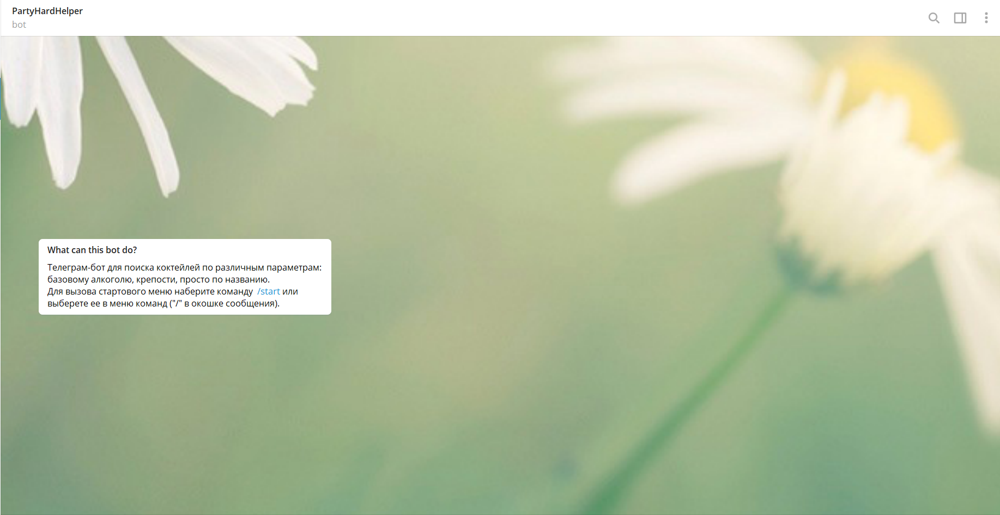
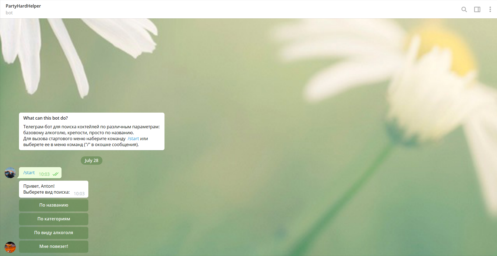
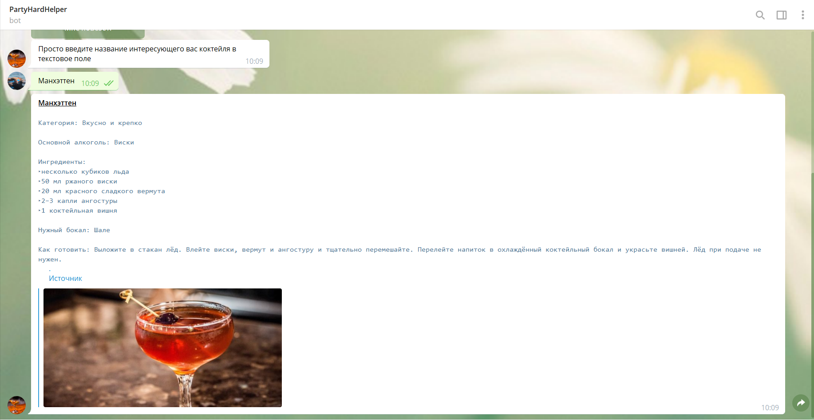
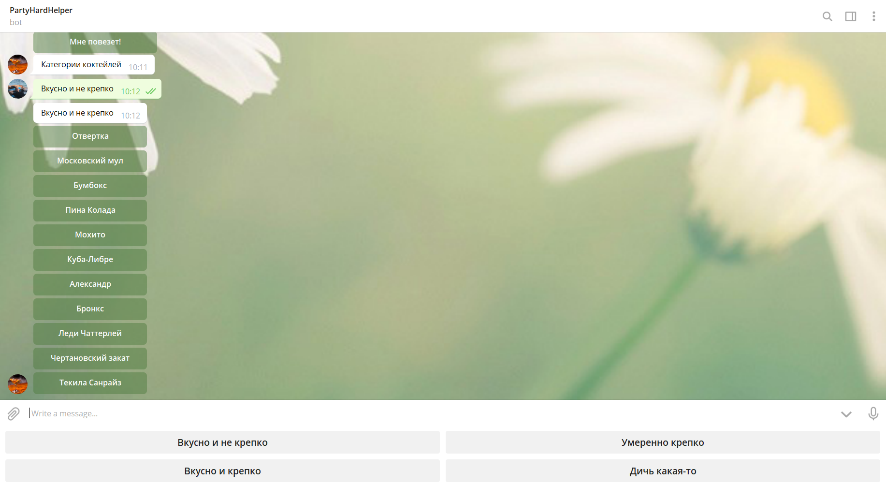
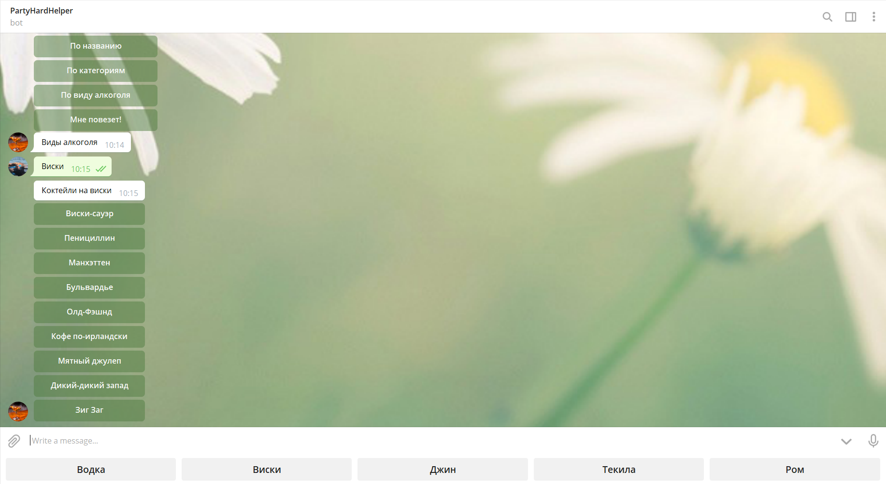
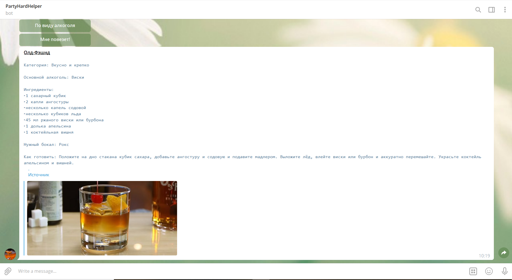

# Party hard helper bot
>
Телеграм-бот с рецептами алкогольных коктейлей.

Вы участник или организатор вечеринки и хотите удивить окружающих вкусным коктейлем, но не настроены долго искать рецепт на просторах интернета?

Part-hard-helper бот позволяет легко и быстро найти интересующий вас коктейль по следующим параметрам:

- виду базового алкоголя;

- условной категории (например, вкусно и не крепко);

- названию;

## Начало работы
```
npm i
npm start
```

## MVP функционал
- Возможность поиска коктейля по названию, виду базового алкоголя или категории;
- Возможность найти случайный коктейль;
- Возможность перейти на первоисточник;
- Гибкая система навигации;

## Автор
[Антон Бочкарев](https://github.com/anbochkarev1991)

## Начало работы
После запуска стартового скрипта "/start" выберете параметр, по которому будет осуществляться поиск.
>

## Поиск по названию
Поиск по названию предполагает, что вы знаете точное название коктейля. Введите его в поле для сообщений и отправьте боту.
>

## Поиск по категориям
Категории коктейлей достаточно условны, но в целом отвечают входящим в них коктейлям. 
Если вы хотите сменить категорию, просто выберете другую кнопку в появившейся под полем для сообщений клавиатуре.
Далее вы выбираете конкретный коктейль.
>

## Поиск по виду алкоголя
В боте собраны коктейли на водке, виски, джине, текиле и роме.
Если вы хотите сменить вид акоголя, просто выберете другую кнопку в появившейся под полем для сообщений клавиатуре.
Далее вы выбираете конкретный коктейль.
>

## Мне повезет!
Команда "Мне повезет!" выдает случайный коктейль из базы коктейлей, доступной боту.
>
